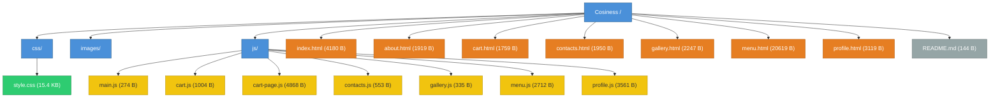

# Cosiness

Creators:
Александр Резчиков
Дубиков Егор
Дикусарэ Сергей

# Диаграмма

```mermaid
graph TD
    Root["Cosiness /"]

    Root --> CSS["css/"]
    Root --> Images["images/"]
    Root --> JS["js/"]

    CSS --> Style["style.css (15.4 KB)"]

    JS --> MainJS["main.js (274 B)"]
    JS --> CartJS["cart.js (1004 B)"]
    JS --> CartPageJS["cart-page.js (4868 B)"]
    JS --> ContactsJS["contacts.js (553 B)"]
    JS --> GalleryJS["gallery.js (335 B)"]
    JS --> MenuJS["menu.js (2712 B)"]
    JS --> ProfileJS["profile.js (3561 B)"]

    Root --> Index["index.html (4180 B)"]
    Root --> About["about.html (1919 B)"]
    Root --> Cart["cart.html (1759 B)"]
    Root --> Contacts["contacts.html (1950 B)"]
    Root --> Gallery["gallery.html (2247 B)"]
    Root --> Menu["menu.html (20619 B)"]
    Root --> Profile["profile.html (3119 B)"]
    Root --> Readme["README.md (144 B)"]

    classDef folder fill:#4A90D9,color:#fff,stroke:#2C5F8A
    classDef html fill:#E67E22,color:#fff,stroke:#B35F14
    classDef js fill:#F1C40F,color:#333,stroke:#B7950B
    classDef css fill:#2ECC71,color:#fff,stroke:#1E8A4E
    classDef other fill:#95A5A6,color:#fff,stroke:#6B7879

    class Root,CSS,Images,JS folder
    class Index,About,Cart,Contacts,Gallery,Menu,Profile html
    class MainJS,CartJS,CartPageJS,ContactsJS,GalleryJS,MenuJS,ProfileJS js
    class Style css
    class Readme other
```